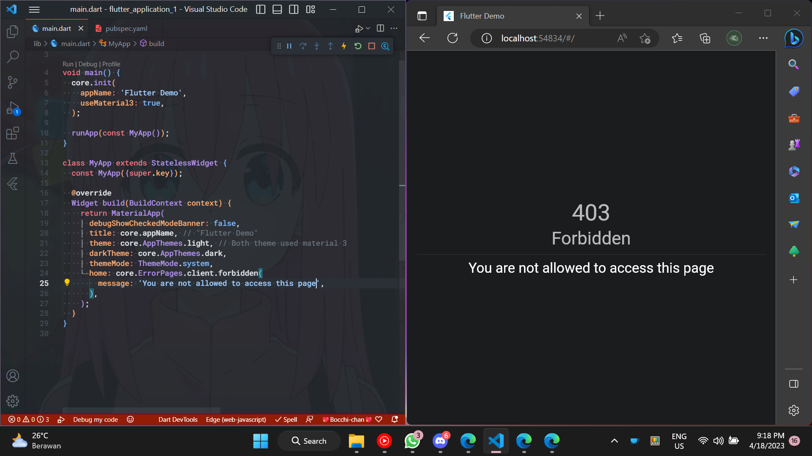

<!--
This README describes the package. If you publish this package to pub.dev,
this README's contents appear on the landing page for your package.

For information about how to write a good package README, see the guide for
[writing package pages](https://dart.dev/guides/libraries/writing-package-pages).

For general information about developing packages, see the Dart guide for
[creating packages](https://dart.dev/guides/libraries/create-library-packages)
and the Flutter guide for
[developing packages and plugins](https://flutter.dev/developing-packages).
-->


A package that provides basic utils like Themes, a common BuildContext
extension, and a simple Error Page widget.

Great for creating lots of Flutter apps as a portfolio.

## Features

- Tired of defining themes manually? just use the default ThemeData from this
  package:

  ```dart
  import 'package:core/core.dart' as core;

  class MyApp extends StatelessWidget {
    const MyApp({super.key});

    @override
    Widget build(BuildContext context) {
      return MaterialApp(
        title: core.appName,
        theme: core.AppThemes.light,
        darkTheme: core.AppThemes.dark,
        ...
      );
    }
  }
  ```

- Need shorthand for the common use of context? Try the BuildContext extension
  from this package:

  ```dart
  import 'package:core/core.dart';

  class MyWidget extends StatelessWidget {
    const MyWidget({super.key});

    @override
    Widget build(BuildContext context) {
      // Shorthand for Theme.of(context)
      context.theme;

      // Shorthand for MediaQuery.of(context)
      context.mediaQuery;

      // Shorthand for Scaffold.of(context)
      context.scaffoldState;

      // Check "src/utils/extensions.dart" for more

      return Container();
    }
  }
  ```

- Need a simple page to display errors from HTTP responses? Try `HttpErrorPages`
  from the package:

  ```dart
  import 'package:core/core.dart';

  // Will display status code 400 with 'Bad Request' text below it.
  HttpErrorPages.client.badRequest();

  // Will display status code 500 with 'Internal Server Error' text below it.
  HttpErrorPages.server.internalServerError();

  // You can also add custom message to the page
  // (Default message is 'Sorry for the inconvenience').
  //
  // The message displayed below statusCode and name.
  HttpErrorPages.client.notFound(message: 'The Page You Requested Not Found');

  // Create `HttpErrorPage` directly if you need a page based on the response 
  // status code.
  HttpErrorPage(404); // Will return 'Not Found' page.

  // See preview below for the page preview.
  ```

  ### HttpErrorPages previews:

  

  - Or do you just need an `Exception` model to handle HTTP response errors? Try
    using `HttpResponseException` from this package.

    ```dart
    throw HttpResponseException(response.code);
    ```

## Getting started

1. Add the package to your dependencies:

   ```yaml
   dependencies:
     core:
       git:
         url: https://github.com/KeidsID/flutter_app_core_package.git
   ```

2. Then, you just need to call `init()` once in `main()`:

   ```dart
   import 'package:core/core.dart' as core;

   void main() {
     core.init();
     ...
   }
   ```

   You can also customize the Theme via `init()`:

   ```dart
   import 'package:core/core.dart' as core;
   import 'package:flutter/material.dart';

   void main() {
     core.init(
       appName: 'My App Name',
       appPrimaryColor: Colors.amber,
       useMaterial3: true,
     );
     ...
   }
   ```

3. You can also add `CoreLocalizations.delegate` to your app to localize the
   default message of `HttpErrorPage`.

   ```dart
   import 'package:core/core.dart' as core;
   import 'package:flutter/material.dart';

   class MyApp extends StatelessWidget {
     const MyApp({super.key});

     @override
     Widget build(BuildContext context) {
       return MaterialApp(
         ...
         localizationsDelegates: CoreLocalizations.localizationsDelegates,
         supportedLocales: CoreLocalizations.supportedLocales,
         ...
       );
     }
   }
   ```

Now, you are ready to use this package's utilities.

## Usage

Simple usage example:

```dart
import 'package:core/core.dart' as core;
import 'package:flutter/material.dart';

void main() {
  core.init(
    appName: 'Flutter Demo',
    useMaterial3: true,
  );

  runApp(const MyApp());
}

class MyApp extends StatelessWidget {
  const MyApp({super.key});

  @override
  Widget build(BuildContext context) {
    return MaterialApp(
      title: core.appName, // "Flutter Demo"
      // Both theme used material 3
      theme: core.AppThemes.light,
      darkTheme: core.AppThemes.dark,
      themeMode: ThemeMode.system,
      // To localize default message of [HttpErrorPage]
      localizationsDelegates: CoreLocalizations.localizationsDelegates,
      supportedLocales: CoreLocalizations.supportedLocales,
      // Simple page to display 404 Not Found
      home: core.HttpErrorPages.client.notFound(),
    );
  }
}
```

## Contributing Localizations

If you want to contribute by adding new localizations please follow these steps:

1. [Fork the repo](https://github.com/KeidsID/flutter_app_core_package/fork).
2. Copy the `lib/l10n/l10n_id.arb` file into the `lib/l10n` folder with a new
   language code, following
   [this list of ISO 859-1 codes](https://en.wikipedia.org/wiki/List_of_ISO_639-1_codes).
   Why copy `l10n_id.arb`? So that you no longer need to delete the template in
   `l10n_en.arb` and focus on localization only.
3. Update the contents in the newly created file. Especially, please update the
   `@locale` value with the corresponding ISO code.
4. Then do the `flutter gen-l10n` command to generate your localization.
5. When you're done,
   [make a new pull request](https://github.com/KeidsID/flutter_app_core_package/pulls)

More about
[Localization in the Flutter Official Documentation](https://docs.flutter.dev/development/accessibility-and-localization/internationalization).
